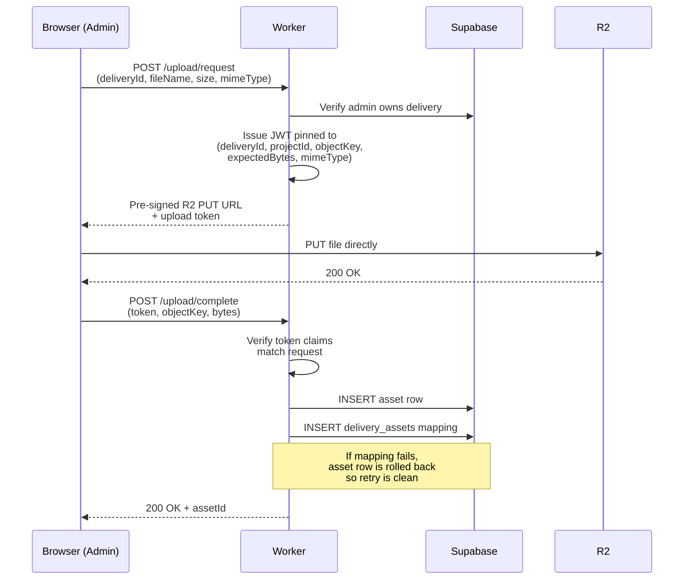

# Architectural Decisions

Each section is a real trade-off I made, with what I picked, why, and what I
gave up. Not a sales pitch — every choice has a cost.

---

## 1. Cloudflare Workers + Hono over a traditional Node server

**Picked:** Cloudflare Workers + Hono, deployed at the edge.

**Why:**
- Sub-100ms cold starts — a traditional Node server on Render/Fly takes 5-10s
  to cold-boot a free instance, which would be miserable for low-volume
  endpoints
- Native R2 binding via `env.R2_MEDIA_BUCKET` — no S3 client setup, no IAM
  juggling
- Generous free tier (100k requests/day) covers my actual traffic
- One deploy unit, no infra to manage, no Docker, no auto-scaling config

**What I gave up:**
- **10ms CPU limit per request on the free tier.** This is the biggest one.
  No long-running work in-process; the streaming-ZIP downloader had to be
  written as a true stream, not "build the buffer then send"
- **No persistent connections.** No WebSockets without Durable Objects
- **Limited Node API.** Most npm packages need polyfills or replacements;
  `fflate` works because it's pure JS
- **Logs are ephemeral** — no file logs, only Cloudflare's tail/observability,
  which means real production debugging needs Sentry or equivalent

**What surprised me:** The CPU limit forced cleaner code. I couldn't be lazy
with sync paths — every blocking operation had to justify itself.

---

## 2. R2 over S3

**Picked:** Cloudflare R2 for all photo storage.

**Why — the math is the whole reason:**
S3 charges ~$0.09/GB egress. For a photo delivery platform, every client
download is egress. Rough math for a single year of my workload:

> 30 events × ~5 GB delivered × ~50 downloads per event ≈ 7.5 TB egress
> S3: ~$675/year. R2: $0.

Storage cost on R2 ($0.015/GB/month) is competitive with S3 standard. The
egress savings dwarf everything else.

**What I gave up:**
- Smaller ecosystem than S3 — fewer tools, fewer Stack Overflow answers
- Region selection is less granular (R2 is auto-routed)
- No native lifecycle policies — auto-deletion of expired files needs to be
  rolled by hand (currently a TODO)
- Slightly less mature; multipart uploads have rare quirks I haven't hit yet

**Escape hatch:** R2 is S3-compatible (SigV4 works, listed earlier). If R2
ever became a problem, swapping to S3 is mostly a config change, not a
rewrite.

---

## 3. Supabase (Postgres + RLS + email-OTP) over Auth0/Clerk + own Postgres

**Picked:** Supabase for both auth and the database.

**Why:**
- Auth + DB in one vendor — one less integration to maintain
- **Row-Level Security** means access control lives in SQL, not in API
  middleware. The class of bugs where someone forgets to check ownership in a
  handler simply disappears — the DB returns zero rows for unauthorized reads
- **Email-OTP** skips the password reset flow entirely. No "forgot password"
  page, no password complexity rules, no breach handling
- Generous free tier; row + auth limits are well above my actual usage

**What I gave up:**
- **Vendor lock-in for auth flows.** Migrating off Supabase later means
  rebuilding the auth integration end-to-end, including email templates and
  recovery flows
- **RLS is SQL-only.** Debugging a "why can't this user read this row?"
  question means reading policy SQL, not stepping through JS — harder for
  newcomers to the codebase
- **Email-OTP requires a configured email template** in the Supabase
  dashboard. I hit this during dev as an unexplained "code never arrives"
  bug — Supabase's default template hides the OTP token in HTML
- **Free tier auto-pauses on inactivity.** This bit me during pre-launch when
  Supabase DNS records went stale; the entire app went down for an afternoon

**What surprised me:** RLS is genuinely good. Once policies are written,
"forgot to check ownership" is no longer a bug class.

---

## 4. Modular monolith over microservices

**Picked:** One Hono worker, organized into route modules
(`admin`, `customer`, `delivery`, `live`, `media`, `upload`) and helper
modules (`http`, `tokens`, `access`).

**Why:**
- One person on this codebase. Microservices add coordination overhead with
  zero benefit at this scale
- Hono's `app.route('/api/v1/admin', adminRoutes)` gives me Rails-style
  namespacing in a single deploy
- Workers scale per-request automatically — splitting services wouldn't help
  scaling
- One deploy unit, one set of secrets, one log stream

**What I gave up:**
- Can't deploy admin separately from public. A bug in admin code requires
  redeploying the public-facing routes too (mitigated by good tests and
  pre-deploy lint/typecheck)
- One bundle size — every public request loads (but doesn't execute) admin
  code paths. Bundle is small enough that this is academic
- Single failure domain — if the worker is down, everything is down

**What surprised me:** The worker `index.ts` grew to ~1,500 lines before I
refactored. I should have split it at 600. Lesson: split when it starts
feeling crowded, not when it becomes unworkable.

---

## 5. Custom HMAC SigV4 over the AWS SDK

**Picked:** ~50 lines of `crypto.subtle` and AWS Signature V4 by hand.

**Why:**
- The AWS SDK is ~500KB unminified. Workers have a 1MB total compressed
  bundle limit on the free tier. The SDK alone would eat 30%+ of the budget
- I only need *one* operation: pre-signed GET/PUT URLs. The SDK exposes
  hundreds of operations I'll never use
- Pre-signed URLs are a stable, well-documented format — not something AWS
  changes often

**What I gave up:**
- **Maintenance.** SigV4 is mine now. Stable, but mine
- **Error legibility.** A wrong canonical-request format returns an opaque
  R2 403 with no useful message. I had to bisect to find a missing newline
- **No free SDK improvements** — multipart upload, retry, transfer
  acceleration. None of which I currently need, but all of which I'd have to
  write myself if I did

**What surprised me:** SigV4 is well-documented but the AWS test vectors are
hostile. Took ~two evenings to get a stable signed URL.

---

## 6. JWT-tokenized direct-to-R2 upload over proxied upload

**Picked:** A three-step flow — request signed URL, upload directly to R2,
finalize. The signed URL is bound to a worker-issued JWT pinned to
`(deliveryId, projectId, objectKey, expectedBytes, mimeType)`.

**Why:**
- Workers have a 100 MB request-body limit on the free tier. Even medium
  photos exceed it; raw event coverage is impossible
- Direct-to-R2 means the worker never sees the bytes — saves bandwidth,
  CPU, and time
- The pinned token means the client can't lie about which delivery the file
  belongs to, what it's named, or how big it is. The finalize endpoint
  validates everything before writing the asset row

**What I gave up:**
- **Three round trips** instead of one for an upload. Slightly more complex
  client logic
- **Finalize is where bugs live.** If finalize never gets called (network
  drop, client crash), the R2 file orphans. Mitigation: files land under a
  `pending/` prefix; orphaned `pending/` keys can be swept by a periodic job
  (currently a TODO)
- **Idempotency is harder.** A retried finalize that arrives after a partial
  failure has to be safe. The current code rolls back the asset row if the
  `delivery_assets` mapping fails, so retries see a clean state

**What surprised me:** The finalize step is the hardest path to test
end-to-end. Most of the upload bugs I shipped were in the "what if this
specific step fails" combinations.

---

## 7. Single-row Postgres config over KV / feature flags

**Picked:** A `live_config` table with one row, holding `title`, `description`,
`is_live`, `updated_at`.

**Why:**
- I already have Postgres — adding a KV/feature-flag service is one more
  integration
- The values are mutable text fields the admin edits in the UI — perfect for
  a row, awkward for a flag
- RLS enforces admin-only writes at the DB level. No middleware check to
  forget
- One indexed query for public reads; cache-friendly with a 60s
  `Cache-Control: public, max-age=60`

**What I gave up:**
- Slight over-engineering. A KV write would be cheaper than a Postgres
  round-trip
- Adding fields = a SQL migration. A JSON blob in KV would be more flexible
- Free-tier Supabase rate limits apply, even for a config endpoint

**What surprised me:** The single-row pattern is nicer than I expected. No
row-ID juggling, simple `WHERE` clauses, easy to reason about.

---

## What I'd revisit

In rough order of how much it'd matter:

1. **R2 lifecycle policies for orphaned uploads.** Currently a TODO, would
   replace the manual cleanup story
2. **Move `SUPABASE_ANON_KEY` from `wrangler.toml` to a wrangler secret.** It's
   publishable, but best practice is to keep all secrets out of source-tracked
   config
3. **Add structured logging + a `/metrics` endpoint** so the operational notes
   in the README can be measured automatically rather than manually
4. **A small Durable Object for upload session state** would let me
   server-track in-flight uploads instead of the current "pending key prefix"
   convention. Probably not worth it yet, but it's the obvious next step if
   the upload flow gets more complex
