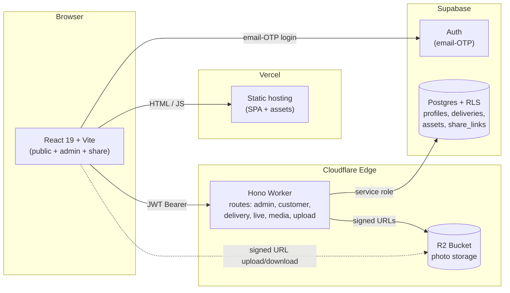

# Rajugari Abbayi Photography

> A working photography delivery platform, built and run by a freelance
> photographer who happens to be a software engineer.

**Live:** [rajugariabbayishots.vercel.app](https://rajugariabbayishots.vercel.app) · **See the work:** [/work](https://rajugariabbayishots.vercel.app/work)

---

## What this is

I'm Vishnu Varma — a software engineer by day and a freelance photographer
(portraits, candids, collabs, events including weddings) by evenings and
weekends. This is the platform I use to run my photography business: public
portfolio, private client galleries, share-link delivery, admin tools, and a
YouTube live page for event coverage.

It's not a side-project demo. It's a production system I depend on for actual
client work.

## Why I built it instead of using Pixieset / Pic-Time / SmugMug

The off-the-shelf tools work, but they didn't fit how I shoot:

- **Felt clunky** for the volume I deliver — too many clicks per delivery
- **Couldn't customize the share page** to match my brand
- **Expensive at my scale** — the per-delivery cost adds up fast for a
  freelancer doing dozens of events a year
- And honestly: I'm an engineer. Building it is part of the value.

## Architecture at a glance

| Layer | Stack | Why |
|---|---|---|
| Frontend | React 19 + TypeScript + Vite, deployed on Vercel | Fast iteration, edge-deployed, generous free tier |
| API | Cloudflare Workers + Hono | Sub-100ms cold starts at the edge, native R2 binding, no infra to manage |
| Storage | Cloudflare R2 | S3-compatible, no egress fees — critical for a photo delivery platform |
| Database | Supabase Postgres + RLS | Auth + database in one place, row-level security enforced at the DB |
| Auth | Supabase email-OTP | Passwordless, no password reset flow to build |
| Error tracking | Sentry (frontend + worker) | Opt-in via env, lightweight HTTP integration on the worker |



The dotted line is the key shape: clients upload and download photos
**directly to/from R2** using short-lived signed URLs that the worker issues —
the worker itself never proxies the bytes. See [`DECISIONS.md`](DECISIONS.md)
for the full trade-offs.

## Engineering highlights

Things that took real thought, in roughly increasing order of "interesting":

- **Modular Hono worker** — split a 1,500-line `index.ts` into route modules
  (`admin`, `customer`, `delivery`, `live`, `media`, `upload`) and helper
  modules (`http`, `tokens`, `access`). Same shape as a Rails-style monolith,
  edge-deployed.
- **Custom HMAC-signed R2/S3 URLs** without the AWS SDK — needed to keep the
  worker bundle small. ~50 lines of `crypto.subtle` and AWS SigV4.
- **JWT-tokenized upload sessions** — the worker issues a short-lived token
  pinned to (deliveryId, projectId, objectKey, expectedBytes), the client
  uploads directly to R2, then calls a finalize endpoint that validates the
  token before writing the DB row.
- **Idempotent upload finalize with compensating cleanup** — if the
  `delivery_assets` mapping insert fails after the asset row is created, the
  asset row is rolled back so the next attempt is clean.
- **Scoped share links** — view-only or download-allowed, full-delivery or
  selected-files, with expiry enforced both at the DB and in the share-gallery
  query. Tokens are random, never enumerable.
- **Streaming ZIP downloads** with `fflate`, parallelized R2 reads — clients
  can download an entire shoot without the worker buffering it in memory.
- **UUID validation** on user-supplied IDs that get interpolated into
  PostgREST `or=(...)` filters — prevents a small but real injection vector.
- **Single-row config pattern** for the live-stream toggle — admin can flip
  the `is_live` flag and update the title/description; non-admin visitors only
  see the page when it's on.
- **Pre-release hardening** — separate `TOKEN_SIGNING_SECRET` from the
  Supabase service-role key, DB-first deletes for orphan-safety, route-level
  rate limits, CORS allowlist tied to `APP_ORIGIN`.

## Performance & operational notes

<!-- Numbers below are placeholders until I measure them — keep honest. -->

- Lighthouse on `/` (mobile): _TBD_
- Worker p95 latency on hot endpoints: _TBD_
- Bundle size: _TBD_ KB gzipped (with Sentry enabled)
- 27 integration tests (Vitest) covering the API client, auth context gating,
  and share-gallery flow. CI is `--max-warnings=0` strict.

## What I learned building this

A few honest reflections:

- **DNS is the silent failure mode.** During pre-launch, my Supabase project
  hit a DNS propagation issue that took the entire app down for an afternoon.
  Reading `dig +trace` output is now a real skill.
- **React 19's new lint rules are strict but correct.** The
  `set-state-in-effect` rule caught a bug in my `getAccessToken` flow that
  would have leaked an expired JWT during logout.
- **Edge compute changes the shape of code.** No long-lived processes, no
  background jobs, no shared memory between requests. You design differently.
- **`prefers-reduced-motion` is not optional**, even on a photography site.

---

## Local dev

```bash
nvm use 20
npm install
cp .env.example .env.local   # fill in keys
npm run dev
```

Worker dev:

```bash
cd worker
npm install
npx wrangler dev
```

| Task | Command |
|---|---|
| Tests | `npm test` (Vitest) |
| Lint | `npm run lint` (ESLint, max-warnings=0) |
| Type-check | `npx tsc --noEmit` |
| Production build | `npm run build` |

Worker secrets and deploy: see [`worker/README.md`](worker/README.md).

---

## Reference

### Media hosting

The app resolves images in this order:
- Remote CDN/storage (when `VITE_MEDIA_BASE_URL` is set)
- Local files from `project-rga/...` (default fallback)

```bash
VITE_MEDIA_BASE_URL=https://cdn.jsdelivr.net/gh/gvvskvarma/rajugari-abbayi-photos@main
```

For best performance, use optimized derivatives in your CDN:

```bash
./scripts/generate-optimized-images.sh
```

This creates `640/1200/1800` JPEG variants in `project-rga/optimized/...`.

### Error tracking (Sentry)

Both frontend and worker support optional Sentry — leave the env vars unset
to disable.

**Frontend (Vercel env):** `VITE_SENTRY_DSN=...`
**Worker (Cloudflare secret):** `wrangler secret put SENTRY_DSN`

### Booking form (Formspree)

```bash
VITE_FORMSPREE_ENDPOINT=https://formspree.io/f/yourFormId
```

### App routes (role-aware)

- `/` — public homepage
- `/work` — public portfolio
- `/about` — about page
- `/live` — YouTube live (visible only when admin toggles on)
- `/book` — booking enquiry form
- `/my-pictures` — customer delivery view (email OTP login required)
- `/upload` — admin upload (admin role required)
- `/admin/clients` — admin client management
- `/share/:token` — scoped share view (full delivery or selected files)

### Deploy on Vercel

`vercel.json` is configured with build settings, asset cache headers, and
security headers. Production deploys from `main` automatically. API and
database deploys are manual.

### Project history

Build-week artifacts (Supabase migrations, API contracts, runbooks) live in
[`docs/`](docs/). The architecture has evolved since — see `DECISIONS.md` for
the current state and trade-offs.
